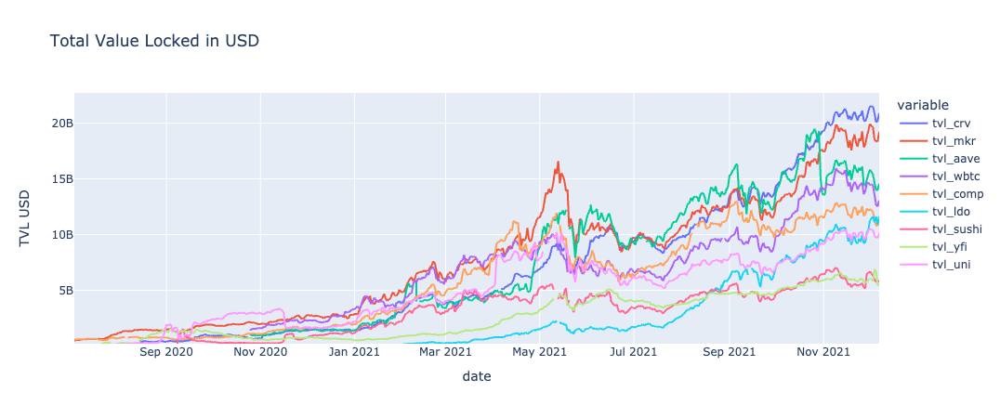

# Crypto ETL Pipeline

An ETL Pipeline for loading (and analyzing) data from glassnode.com / defillama.com. The obtained data is/can be uploaded to a cloud hosted MongoDB backed by a free-tier AWS; Plotting using plotly.

- To try this jupyter notebook interactively and without installing/downloading, open in colab:
  https://colab.research.google.com/github/glensk/Crypto-ETL-Pipeline/blob/main/tvl_analysis.ipynb

- To use this notebook with the cloud-hosted mongoDB database, comment in the two lines in the section "Write to & read from MongoD".
  mu.write_db(dall)
  dall = mu.read_db() # resets dall dataframe
  

requirements: (conda or pip install)
  - pandas
  - numpy
  - plotly
  - pymongo

